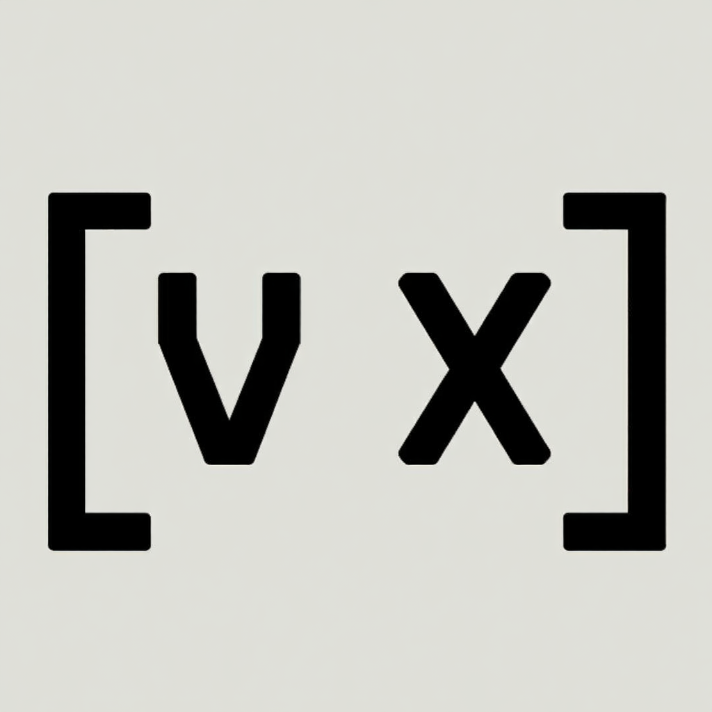

# VYRONIX Language Support

Official Visual Studio Code extension for the **VYRONIX** programming language.

## Features

- **Syntax Highlighting**: Beautifully colored keywords, types, and operators.
- **Run Button (▶️)**: Execute your VYRONIX scripts directly from the editor.
- **Debugger Support**: Integrated debugging framework for step-by-step execution.
- **Language Recognition**: Automatic detection of `.vx` and `.vyx` files.

## Installation

### From Marketplace (Coming Soon)
Search for "VYRONIX" in the VS Code Extensions tab.

### Manual Installation (.vsix)
1. Download the `vyronix-1.0.0.vsix` file from the [GitHub Releases](https://github.com/sahikxd/vyronix-lang-extention/releases).
2. In VS Code, go to the Extensions view (`Ctrl+Shift+X`).
3. Click the `...` menu in the top right corner.
4. Select **Install from VSIX...** and choose the downloaded file.

## Requirements

- **VYRONIX Engine**: You must have `vyx.exe` in your system PATH to use the Run button.
- **.NET 10.0+**: Required for advanced language features and debugging.

## Usage

1. Open any `.vx` file.
2. Click the **Play (▶️)** button in the top right corner to run.
3. Use `#` for comments.

---
Developed by **sahikxd** | [VYRONIX Language](https://github.com/sahikxd/vyronix-lang)
